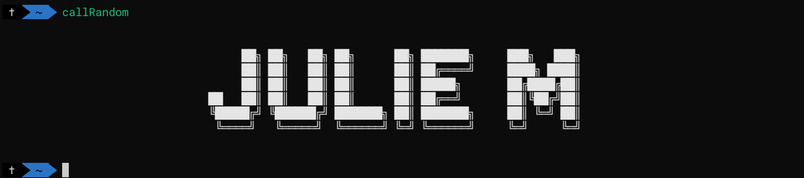
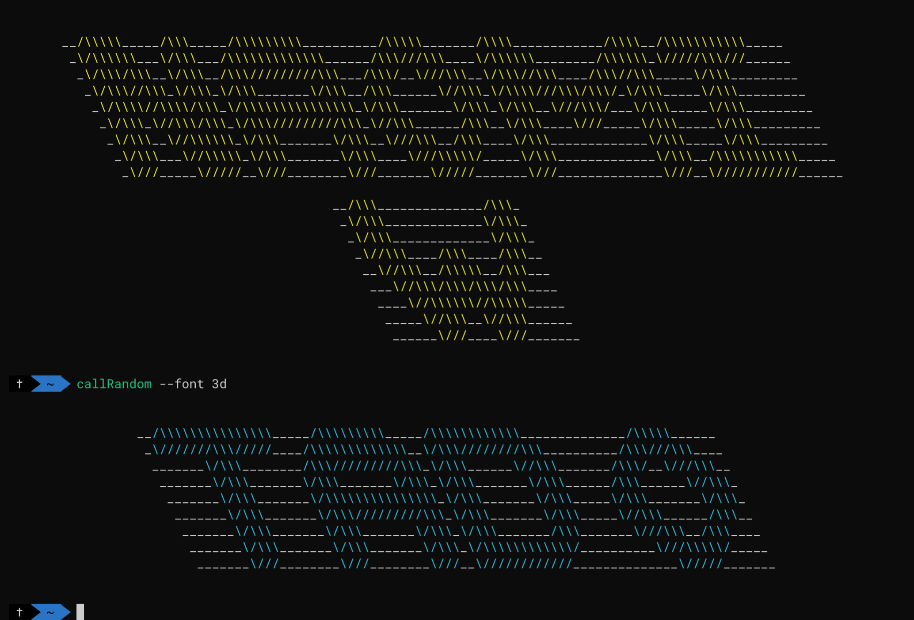
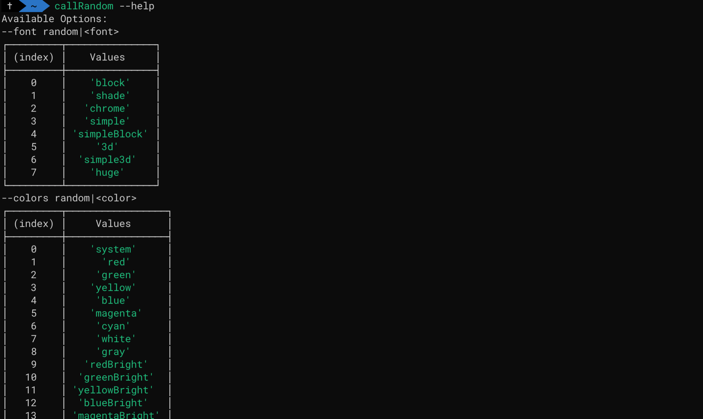

# cli-random-student
Calls a random student from the list while ensuring all students get called.

From within the `cli-random-student` directory:

```shell
# Default
node random-student.js
```

Or, from anywhere using an optional shell alias:

Put this in your `~/.profile` file otherwise this alias won't be loaded for future terminals. _(create this file not already present)_

```shell
# Ensure the path below is the actual path where you downloaded it to.
alias callRandom='node ~/cli-random-student/random-student.js'
```

Second alias for in-class quickness:

```shell
alias p="callRandom --clearOnCall --align right --font random"
```

## How it works

Script keeps track of history using the `random-student.log` file.
Once all students have been called the history is cleared and the process starts over. 

When testing the various options it is recommended to configure a test log file so as not to disrupt the order of actual in class calls.  The following command `--logFile='/test.log'` will set a custom test log file for these purposes.

*requires default log file `random-student.log` or custom log file to exist e.g. `touch random-student.log` before first run.

## Defaults

- `--font=block`
- `--colors=random`
- `--background=transparent`
- `--align=center`



## Align

- `--align=<left|center|right>`


## Font

- `--font=3d`



- `--font=random`

- `--plan` or `-p`

- `--verbose` or `-v`


- `--clearOnCall` clear terminal screen.

- `--logFile='/test.log'` specify custom history log file.
## Help

- `--help` display list of color, font, background, align options.



---

For spoken names use the following shell command:

```shell

say $(p --logFile=/test.json --p) -v Daniel

```

Say command English speaking voices (--voice | -v):

```shell
Alex                en_US    # Most people recognize me by my voice.
Fred                en_US    # I sure like being inside this fancy computer
Samantha            en_US    # Hello, my name is Samantha. I am an American-English voice.
Victoria            en_US    # Isn't it nice to have a computer that will talk to you?
Fiona               en-scotland # Hello, my name is Fiona. I am a Scottish-English voice.
Daniel              en_GB    # Hello, my name is Daniel. I am a British-English voice.
Moira               en_IE    # Hello, my name is Moira. I am an Irish-English voice.
Veena               en_IN    # Hello, my name is Veena. I am an Indian-English voice.
Karen               en_AU    # Hello, my name is Karen. I am an Australian-English voice.
```


---

Complete Alias Setup

Add to following alias's to your .bash_aliases file.

```shell

alias callRandom="node ~/Code/random-student/random-student.js"
alias p="callRandom --align right --font random"
alias pp="callRandom --clearOnCall --align right --font random"
# Set say command voice e.g --voice/-v 
alias say="say -v Daniel"
alias pSay="p --p --fullname | say"
alias pSayTest="p --logFile=/test.json --p --fullname | say"


```
